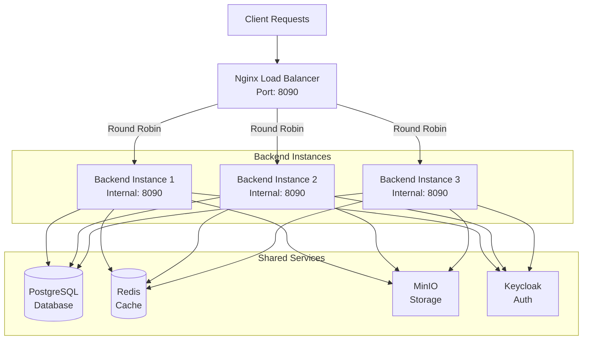

# Devlabs Backend

Spring Boot backend API for the Devlabs project management and evaluation system. Provides RESTful endpoints for managing courses, projects, teams, evaluations, and user authentication.

## Tech Stack

- **Framework:** Spring Boot 3.x
- **Language:** Kotlin
- **Build Tool:** Gradle
- **Database:** PostgreSQL
- **Cache:** Redis
- **Storage:** MinIO (S3-compatible)
- **Authentication:** Keycloak (OAuth2/JWT)
- **Java Version:** 21

## Prerequisites

- Java 21 or higher
- Docker & Docker Compose (for containerized setup)
- OR PostgreSQL, Redis, MinIO, Keycloak (for local setup)

## Quick Start with Docker

### 1. Clone the repository

```bash
git clone https://github.com/TharunCodes07/devlabs-backend.git
cd devlabs-backend
```

### 2. Configure environment

Copy the example environment file and update with your values:

```bash
cp .env.example .env
```

Edit `.env` and update passwords and secrets for production.

### 3. Run with Docker Compose

```bash
docker-compose up -d
```

This will start:

- PostgreSQL database
- Redis cache
- MinIO object storage
- Keycloak authentication server
- Backend application

The API will be available at `http://localhost:8090`

### 4. Stop services

```bash
docker-compose down
```

To remove volumes as well:

```bash
docker-compose down -v
```

## Local Development Setup

### 1. Start dependencies

Start only the required services:

```bash
docker-compose up -d postgres redis minio keycloak
```

### 2. Configure environment

Copy `.env.example` to `.env` and ensure local URLs:

```env
SPRING_PROFILES_ACTIVE=dev
DB_URL=jdbc:postgresql://localhost:5432/devlabs
REDIS_HOST=localhost
MINIO_URL=http://localhost:9000
KEYCLOAK_ADMIN_SERVER_URL=http://localhost:8060
```

### 3. Run the application

```bash
./gradlew bootRun
```

Or build and run the JAR:

```bash
./gradlew clean build
java -jar build/libs/*.jar
```

The API will be available at `http://localhost:8090`

## Environment Variables

Key environment variables (see `.env.example` for complete list):

| Variable                  | Description                      | Default        |
| ------------------------- | -------------------------------- | -------------- |
| `SPRING_PROFILES_ACTIVE`  | Active Spring profile (dev/prod) | `dev`          |
| `POSTGRES_USER`           | Database username                | `devlabs_user` |
| `POSTGRES_PASSWORD`       | Database password                | -              |
| `POSTGRES_DB`             | Database name                    | `devlabs`      |
| `REDIS_PASSWORD`          | Redis password                   | -              |
| `MINIO_ACCESS_KEY`        | MinIO access key                 | `minioadmin`   |
| `MINIO_SECRET_KEY`        | MinIO secret key                 | -              |
| `KEYCLOAK_ADMIN_USERNAME` | Keycloak admin username          | `admin`        |
| `KEYCLOAK_ADMIN_PASSWORD` | Keycloak admin password          | -              |
| `JWT_ISSUER_URI`          | Keycloak realm issuer URI        | -              |

## API Documentation

Once running, access API documentation at:

- Swagger UI: `http://localhost:8090/docs`
- OpenAPI JSON: `http://localhost:8090/v3/api-docs`

## Development

### Build the project

```bash
./gradlew build
```

### Run tests

```bash
./gradlew test
```

### Clean build

```bash
./gradlew clean build
```

### Format code

```bash
./gradlew ktlintFormat
```

## Project Structure

```
devlabs-backend/
├── src/
│   ├── main/
│   │   ├── kotlin/com/devlabs/devlabsbackend/
│   │   │   ├── batch/           # Batch management
│   │   │   ├── core/            # Core configurations
│   │   │   ├── course/          # Course management
│   │   │   ├── dashboard/       # Dashboard analytics
│   │   │   ├── department/      # Department management
│   │   │   ├── evaluation/      # Evaluation system
│   │   │   ├── project/         # Project management
│   │   │   ├── review/          # Review system
│   │   │   ├── rubrics/         # Rubrics management
│   │   │   ├── security/        # Security & auth
│   │   │   ├── semester/        # Semester management
│   │   │   ├── team/            # Team management
│   │   │   └── user/            # User management
│   │   └── resources/
│   │       ├── application.properties
│   │       └── application-dev.properties
│   └── test/
├── build.gradle.kts
├── docker-compose.yml
├── Dockerfile
└── .env.example
```

## Service URLs

When running with Docker Compose:

- Backend API: `http://localhost:8090`
- PostgreSQL: `localhost:5432`
- Redis: `localhost:6379`
- MinIO API: `http://localhost:9000`
- MinIO Console: `http://localhost:9001`
- Keycloak: `http://localhost:8060`

## Production Deployment

### Single Instance (Simple Setup)

For single instance deployment without load balancing:

#### 1. Update environment

Set production values in `.env`:

```env
SPRING_PROFILES_ACTIVE=prod
```

Update all passwords, secrets, and URLs to production values.

#### 2. Deploy with Docker Compose

```bash
docker-compose up -d
```

#### 3. Check logs

```bash
docker-compose logs -f backend
```

### Multi-Instance with Load Balancing (High Availability)

For production environments requiring high availability and load balancing across multiple backend instances:



#### Architecture Overview

- **Nginx Reverse Proxy:** Distributes incoming requests across 3 backend instances using round-robin algorithm
- **Load Balancing:** Automatic failover if an instance becomes unhealthy (max 3 fails, 30s timeout)
- **Shared State:** All instances share the same PostgreSQL, Redis, MinIO, and Keycloak
- **Health Checks:** Nginx monitors `/actuator/health` endpoint for each backend instance
- **Scalability:** Add or remove instances by modifying `docker-compose.prod.yml`

#### 1. Configure Nginx

The `nginx.conf` file is already configured for load balancing. You can adjust the number of instances by modifying the upstream block:

```nginx
upstream backend_servers {
    server backend-1:8090 max_fails=3 fail_timeout=30s;
    server backend-2:8090 max_fails=3 fail_timeout=30s;
    server backend-3:8090 max_fails=3 fail_timeout=30s;
}
```

#### 2. Deploy with production compose file

```bash
docker-compose -f docker-compose.prod.yml up -d
```

This will start:

- 3 backend instances (backend-1, backend-2, backend-3)
- 1 Nginx load balancer (exposed on port 8090)
- Shared PostgreSQL, Redis, MinIO, and Keycloak

#### 3. Scale instances dynamically

To add more instances, edit `docker-compose.prod.yml` and add backend-4, backend-5, etc., then update `nginx.conf` and restart:

```bash
docker-compose -f docker-compose.prod.yml up -d --scale backend-4=1
```

#### 4. Monitor health

Check which backend instance is serving requests:

```bash
curl -I http://localhost:8090/actuator/health
```

Look for the `X-Upstream-Server` header to see which instance responded.

#### 5. View logs

All instances:

```bash
docker-compose -f docker-compose.prod.yml logs -f
```

Specific instance:

```bash
docker-compose -f docker-compose.prod.yml logs -f backend-1
```

Nginx logs:

```bash
docker-compose -f docker-compose.prod.yml logs -f nginx
```

#### Benefits

- **High Availability:** If one instance fails, Nginx automatically routes to healthy instances
- **Load Distribution:** Requests distributed evenly using round-robin
- **Zero Downtime Deployments:** Rolling updates possible by restarting instances one at a time
- **Horizontal Scaling:** Easy to add more instances as traffic grows

## Troubleshooting

### Database connection issues

Ensure PostgreSQL is running and credentials are correct:

```bash
docker-compose logs postgres
```

### Redis connection issues

Check Redis is running and password is set:

```bash
docker-compose logs redis
```

### Application won't start

Check application logs:

```bash
docker-compose logs backend
```

Or for local development:

```bash
./gradlew bootRun --info
```

## Contributing

1. Fork the repository
2. Create a feature branch (`git checkout -b feature/amazing-feature`)
3. Commit your changes (`git commit -m 'Add amazing feature'`)
4. Push to the branch (`git push origin feature/amazing-feature`)
5. Open a Pull Request

## License

This project is part of the Devlabs ecosystem.
